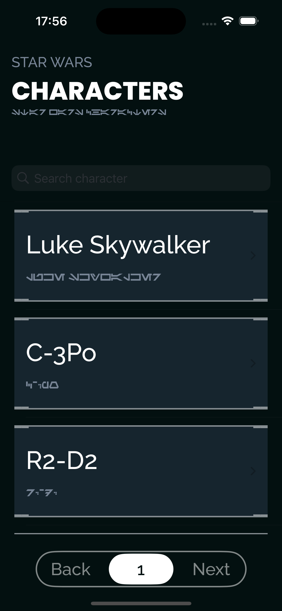
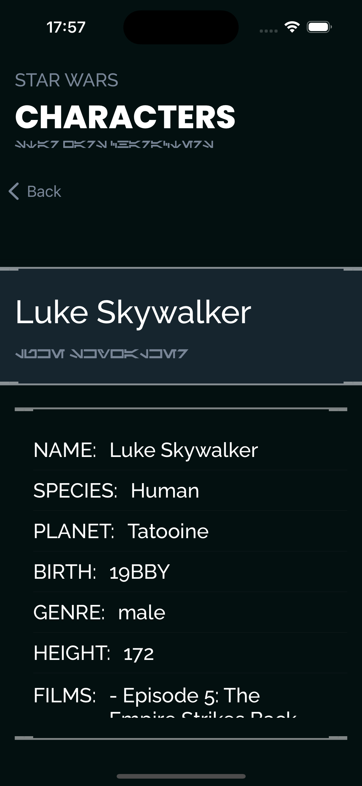

# Star Wars Encyclopedia

Esta es una aplicación de la Enciclopedia de Star Wars desarrollada en Swift utilizando SwiftUI. Utiliza la API de Star Wars (SWAPI) para obtener y mostrar información sobre los personajes de Star Wars.

## Características

- Lista de personajes de Star Wars con paginación.
- Vista detallada de cada personaje, incluyendo su especie, planeta natal, películas en las que aparecen y otros atributos.
- Funcionalidad de búsqueda para encontrar personajes por nombre.
- Manejo de errores para problemas de red.

## Capturas

    
    

## Estructura

El proyecto está estructurado en varios archivos Swift, cada uno con un propósito específico. Las vistas principales que recogen todos los componentes y lógica de la app son:

- `CharactersListViewModel.swift`: Este archivo contiene la clase `CharactersListViewModel` que se encarga de obtener la lista de personajes de la API y gestionar el estado de la vista de la lista.
- `CharactersListView.swift`: Este archivo contiene la estructura `CharactersListView` que es una vista SwiftUI que muestra la lista de personajes.
- `CharactersDetailViewModel.swift`: Este archivo contiene la clase `CharactersDetailViewModel` que se encarga de obtener los detalles de un personaje específico de la API y gestionar el estado de la vista de detalles.
- `CharactersDetailView`: Este archivo contiene la estructura `CharactersDetailViewModel` que es una vista SwiftUI que muestra la lista de características del personaje seleccionado.

## Configuración

Para ejecutar este proyecto, necesitas tener instalado Xcode y un Mac con macOS. Abre el proyecto en Xcode y ejecútalo ya sea en el simulador o en un dispositivo físico.

## Contribuciones

Las contribuciones son bienvenidas. Por favor, abre una solicitud de extracción con tus cambios.

## Licencia

Este proyecto es de código abierto, bajo la licencia Apache 2.0.
